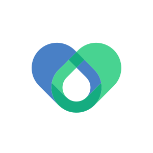

# 🚑 MedEm: Emergency Responder Prototype
**A Fast, Real-Time Location Tracking Application for Medical Emergencies**

*Instantly connect with nearby emergency responders and stream your live location when you need help the most.*

**[Overview](#-overview)** | **[Features](#-key-features)** | **[Installation Guide](#-how-to-install-the-app-pwa)** | **[For Developers](#%EF%B8%8F-for-developers--contributors)**

---

## 📖 Overview

**MedEm** is an emergency tracking application designed to save lives by cutting down emergency response times. It instantly connects **Patients** in need with the closest available **Medical Responders** (Doctors/Nurses) on an interactive live map.

Using fast, modern web technologies, MedEm creates a seamless and secure connection between those needing help and those able to give it.

---

## ✨ Key Features

### 🔒 Core Security (Phase 2)
- **Supabase Identity Verification:** Choose between entering immediately as an anonymous guest or registering a robust, verifiable emergency profile locked behind Supabase Email Authentication.
- **Secure Session Recovery:** Full-scale password reset and lifecycle routing protects your data locally and remotely.

### 🆘 For Patients (Send an SOS)
- **One-Tap Emergency Alert:** Simply press the big red SOS button to instantly alert all verified medical professionals near your location.
- **Smart Clinic Locator:** If no responders are nearby, the app automatically finds and routes you to the Top 3 nearest hospitals or medical clinics.
- **Secure Communication:** Once a responder accepts your SOS, you can safely chat and share vital details. All messages are completely encrypted.

### 🚑 For Responders (Save Lives)
- **Real-Time Alerts:** Receive instant pop-up notifications the moment a patient nearby triggers an SOS.
- **Live Navigation:** Lock onto a patient's signal and follow the dynamic routing arrow to their exact coordinates with live distance-tracking.
- **Custom Response Radius:** Choose how far you are willing to travel (`500m`, `1km`, or `2km`) so you only receive alerts you can realistically respond to.

---

## 📱 How to Install the App (PWA)

MedEm is a Progressive Web App (PWA). This means you don't need to download it from an app store. You can install it directly from your web browser to your phone's home screen for a fast, native app experience!

### Android (Google Chrome)
1. Open the MedEm website in **Google Chrome**.
2. Tap the **Three Dots (⋮)** menu icon in the top right corner.
3. Select **"Add to Home screen"** or **"Install app"**.
4. Confirm the installation. MedEm will now appear on your home screen!

### iOS (Safari or Chrome)
1. Open the MedEm website in **Safari** (or Chrome) on your iPhone/iPad.
2. Tap the **Share** icon (the square with an arrow pointing up) at the bottom center.
3. Scroll down and tap **"Add to Home Screen"**.
4. Tap **Add** in the top right corner.

---

## 🤖 AI Customization (For Advanced Users)

MedEm features an upcoming AI Assistant to help summarize medical records. If you are testing this feature during our Demo Mode, you can securely plug in your own Private AI key in your Account Settings. Your key never leaves your device!

Get your free API keys here:
*  **[Google Gemini (Recommended & Free)](https://aistudio.google.com/app/apikey)**
*  **[OpenAI (ChatGPT)](https://platform.openai.com/api-keys)**
*  **[Anthropic (Claude)](https://console.anthropic.com/)**

---

## 🛠️ For Developers & Contributors

Are you a software engineer looking to deploy MedEm locally, understand the system architecture, or contribute code to the repository? 

👉 **[Read the comprehensive Developer Documentation (DEV-README.md)](./DEV-README.md)**

---

## 🤝 Support & Contact

---

## ⚖️ Privacy & Compliance

MedEm is architected specifically to meet the high data isolation thresholds required in modern medical environments. We respect your physical coordinates and emergency tracking data.
Our Supabase Cloud Infrastructure natively maps strictly to the following standards:
*   **GDPR / CCPA:** Explicit Right to Data Erasure & Portability.
*   **HIPAA / ISO 27001:** Enforced Row-Level Security (RLS) PostgreSQL constraints & AES-256 E2E payloads.

👉 **[Read the full Privacy & Compliance Document (PRIVACY_POLICY.md)](./PRIVACY_POLICY.md)**

I actively welcome open-source developers to contribute! If you find MedEm's core mission compelling, feel free to submit Pull Requests or open Issues on GitHub. Let's build a faster, more robust emergency tracking platform together!

Connect with me using the links below:

